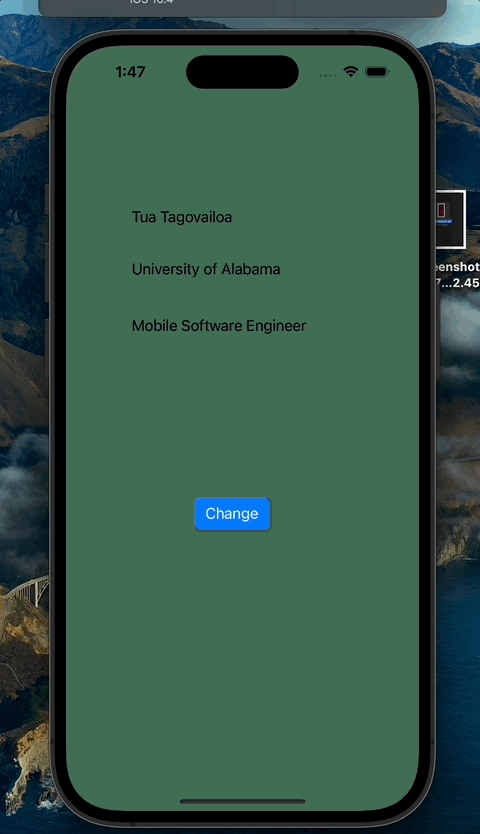

# Prework - *MyFirstApp*

Submitted by: **Jimmy Ocaya**

**MyFirstApp** is an app that... changes the background color to a random color whenever the button is clicked

Time spent: **1.5** hours spent in total

## Required Features

The following **required** functionality is completed:

- [X] Users are see a screen with three labels and a button
- [X] Tapping the button changes the screen color to a random color
 
## Video Walkthrough

Here's a walkthrough of implemented user stories:

<!-- Replace this with whatever GIF tool you used! -->
GIF created with Kap

## App Brainstorming (Step 4)
The list of the apps that I like are:
Example App: **Snapchat**
-It's able to notify you if a screenshot is taken.
-It has map which is used to share locations with friends.
-I like the fact that you can choose who to share your location with.

Example App: **Dominos App**
-I like the fact that you are able to track the status of your order 
-I like the fact that it keeps records of all your previous orders(This is done by almost all apps).

Example App: **Instagram**
-I like the fact that you can unsend messages without the other person realising
-I like the fact that it can suggest the people you are supposed to follow basing on your contacts.

I would like to build an app which helps to detect certain diseases in plants. For example in potatoes, the app would help to detect potato virus y (PVY). And this would be done by scanning the leaves of the potato plant.

## Notes

Describe any challenges encountered while building the app.

## License

    Copyright [2023] [Jimmy Ocaya]

    Licensed under the Apache License, Version 2.0 (the "License");
    you may not use this file except in compliance with the License.
    You may obtain a copy of the License at

        http://www.apache.org/licenses/LICENSE-2.0

    Unless required by applicable law or agreed to in writing, software
    distributed under the License is distributed on an "AS IS" BASIS,
    WITHOUT WARRANTIES OR CONDITIONS OF ANY KIND, either express or implied.
    See the License for the specific language governing permissions and
    limitations under the License.

